 &nbsp; 

 

## GitHub stats

 

## Contribution activity

 

 

## Tech stack

**Languages**  
        

**Web &amp; UI**  
    

**Tooling &amp; DevOps**  
    

**AI &amp; data**  
   

 

## Selected work

| Project | Stack | What it is | Status |
| --- | --- | --- | --- |
| **[KeyRotator](https://github.com/Niko-Vanetti/key-rotator)** | `TypeScript` | VS Code extension to rotate AI provider API keys and run an agent (NVIDIA Build/OpenRouter) with tools, agency mode and viability analysis. | public |
| **[GG Groups](https://github.com/Niko-Vanetti/gg-groups)** | `JavaScript` | Your whole activity bar in one panel: every sidebar icon visible at once, grouped into folders you make by dragging one icon onto another. | public |
| **[Niko IDE Verilog](https://ide-hdl-verilog.web.app)** | `TypeScript` | Web Verilog IDE in Spanish: editor, simulation and RTL view in the browser. | private |
| **[Niko Skills](https://github.com/Niko-Vanetti/niko-skills)** | `Markdown` | Collection of generic skills for Claude Code / AI agents: dev, business, content. | public |
| **[Game Guard](https://github.com/Niko-Vanetti/game-guard)** | `Python` | Schedule-based videogame blocking for Windows. | public |
| **Niko Agents** | `Python` | Python agents and automations with workflow orchestration. | private |
| **[Windows Startup Manager](https://github.com/Niko-Vanetti/Windows-Startup-Manager)** | `Python` | Python desktop app to tune up Windows: manage startup programs and safely disable non-essential background services. | public |
| **[Mercurio Systems](https://mercuriosystems.com/es/)** | `TypeScript` | Digital systems for businesses: online booking, CRM, automation, dashboards and custom software. | private |
| **[MoneyBoxRD](https://moneyboxrd.com)** | `Web` | Savings certificates at a guaranteed 7% plus discounts at partner stores. | private |

 

## The snake

_It walks the calendar above and eats every day that had activity. Rebuilt daily from the same contribution data._

 

## About

I build developer tooling, AI agents and embedded/mechatronics systems. Most of my time goes to designing IDEs and automation that make hard things feel simple, working across the stack from the browser down to the silicon.

- Web & tooling: TypeScript, JavaScript, custom IDE/editor surfaces
- Systems & embedded: C, C++, Verilog (Tang Primer FPGAs), mechatronics at ITLA
- AI & automation: Python agents, workflow orchestration
- Mobile: Swift, Kotlin / Java

Everything on this profile is generated by code. The header, the metrics, the language chart and the project list are rendered from live repository data by [`generate.py`](./generate.py) and refreshed automatically by a GitHub Action. The only hand-written part is the projects that live outside my own repos.

 

## Connect

 

_Last refreshed: 2026-08-29 12:41 UTC_

