 &nbsp; 

 

## Estadísticas

 

## Actividad de contribuciones

 

 

## Tecnologías

**Lenguajes**  
        

**Web y UI**  
    

**Herramientas y DevOps**  
    

**IA y datos**  
   

 

## Trabajo seleccionado

| Proyecto | Stack | Qué es | Estado |
| --- | --- | --- | --- |
| **[GG Groups](https://github.com/Niko-Vanetti/gg-groups)** | `JavaScript` | Toda la barra de actividad en un panel: cada icono de la barra lateral visible a la vez, agrupado en carpetas que creas arrastrando un icono sobre otro. | público |
| **[KeyRotator](https://github.com/Niko-Vanetti/key-rotator)** | `TypeScript` | Extensión de VS Code para rotar API keys de proveedores de IA y correr un agente (NVIDIA Build/OpenRouter) con herramientas, modo agencia y análisis de viabilidad. | público |
| **[Niko IDE Verilog](https://ide-hdl-verilog.web.app)** | `TypeScript` | IDE web de Verilog en español: editor, simulación y vista RTL en el navegador. | privado |
| **Niko Skills Unlocked** | `Markdown` | Backup privado y completo de todas mis skills de Claude Code, personales incluidas. | privado |
| **[Niko Skills](https://github.com/Niko-Vanetti/niko-skills)** | `Markdown` | Colección de skills genéricas para Claude Code / agentes IA: dev, negocio, contenido. | público |
| **[Game Guard](https://github.com/Niko-Vanetti/game-guard)** | `Python` | Bloqueo de videojuegos por horario en Windows. | público |
| **Niko Agents** | `Python` | Agentes y automatizaciones en Python con orquestación de flujos. | privado |
| **[Windows Startup Manager](https://github.com/Niko-Vanetti/Windows-Startup-Manager)** | `Python` | App de escritorio en Python para optimizar Windows: gestiona los programas de inicio y desactiva servicios en segundo plano no esenciales de forma segura. | público |
| **[Mercurio Systems](https://mercuriosystems.com/es/)** | `TypeScript` | Sistemas digitales para negocios: reservas online, CRM, automatización, dashboards y software a medida. | privado |
| **[MoneyBoxRD](https://moneyboxrd.com)** | `Web` | Ahorro por certificados al 7% garantizado y descuentos en comercios afiliados. | privado |

 

## La serpiente

_Recorre el calendario de aquí arriba y se va comiendo los días en los que hubo actividad. Se rehace a diario con esos mismos datos._

 

## Acerca de

Construyo herramientas para desarrolladores, agentes de IA y sistemas embebidos/mecatrónicos. Dedico la mayor parte del tiempo a diseñar IDEs y automatizaciones que vuelven simple lo difícil, trabajando en todo el stack desde el navegador hasta el silicio.

- Web y tooling: TypeScript, JavaScript, editores/IDE a medida
- Sistemas y embebidos: C, C++, Verilog (FPGAs Tang Primer), mecatrónica en el ITLA
- IA y automatización: agentes en Python, orquestación de flujos
- Móvil: Swift, Kotlin / Java

Todo este perfil está generado por código. La cabecera, las métricas, el gráfico de lenguajes y la lista de proyectos se renderizan con datos reales de los repos mediante [`generate.py`](./generate.py) y se refrescan solos con una GitHub Action. Lo único escrito a mano son los proyectos que no viven en un repo mío.

 

## Contacto

 

_Última actualización: 2026-08-27 17:38 UTC_

